Este tutorial cobre a instalação padrão do Windows 11: criar o PenDrive de instalação e aplicar um script que automatiza a maior parte da configuração inicial.

## 1. Criação do PenDrive de instalação

<Callout type="info" title="Pré-requisitos">

* Um PenDrive com pelo menos 8 GB.
* Conexão com a internet para baixar o Windows 11.

</Callout>

1. Acesse o [site da Microsoft](https://www.microsoft.com/pt-br/software-download/windows11) e, na seção **Criar mídia de instalação do Windows 11**, clique em **Baixar Agora**.

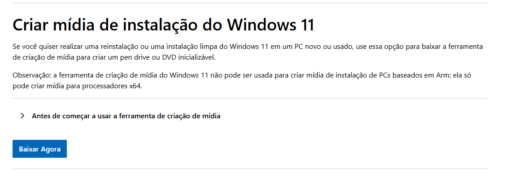

<Callout type="info" title="Por que usar a ferramenta de criação de mídia?">
Embora seja possível baixar a ISO diretamente, quando usamos a ferramenta de criação de mídia é possível formatar o computador sem precisar desligar o Secure Boot.

O que não é possível usando ferramentas de terceiros, como o Rufus e o Ventoy.
</Callout>

2. Execute o arquivo baixado, **MediaCreationTool.exe**.

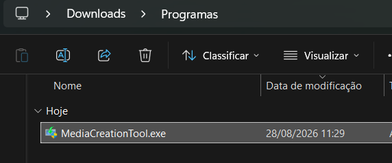

3. Leia e clique em **Aceitar** para concordar com os termos de licença.

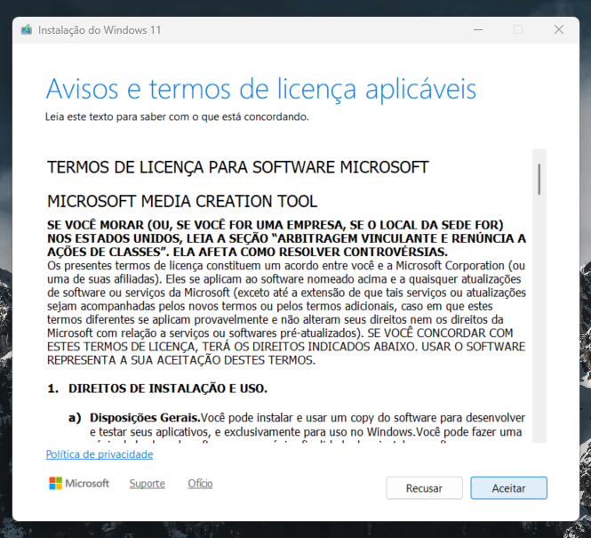

4. Selecione o idioma e a edição do Windows. Deixe a opção **Usar as opções recomendadas para este computador** desmarcada, para garantir que o **Windows 11** seja selecionado, e clique em **Avançar**.

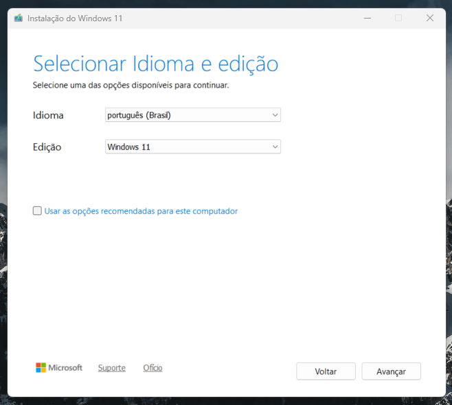

5. Escolha **Unidade flash USB** como mídia e clique em **Avançar**.

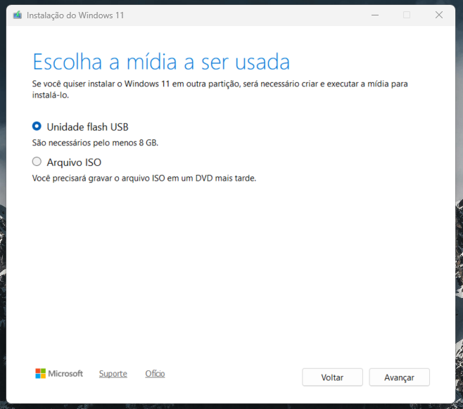

6. Selecione o seu PenDrive na lista de unidades removíveis e clique em **Avançar**.

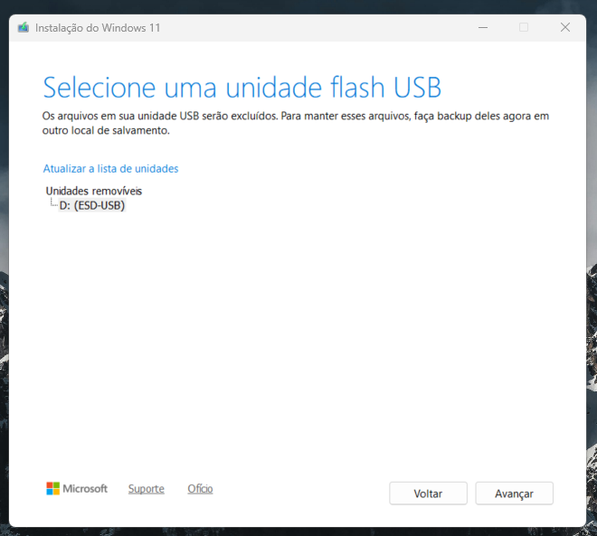

<Callout type="warn" title="Atenção">

Confira se selecionou o PenDrive correto: todo o conteúdo dele será apagado neste processo. Faça backup de qualquer arquivo importante antes de continuar.

</Callout>

7. Aguarde o download do Windows 11 e a criação automática da mídia de instalação. O tempo varia de acordo com a velocidade da sua internet.

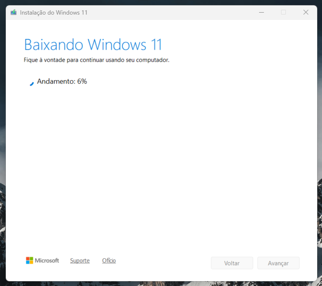

8. Ao final, o PenDrive aparecerá no Explorador de Arquivos como **ESD-USB**.

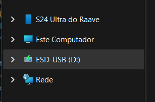

Neste ponto o PenDrive está pronto.

### Opcional: script de instalação semi-automática

Para acelerar a instalação, é possível usar um script do tipo [autounattend.xml](https://learn.microsoft.com/en-us/windows-hardware/manufacture/desktop/update-windows-settings-and-scripts-create-your-own-answer-file-sxs?view=windows-11). Ele responde automaticamente às perguntas do instalador do Windows, como aceitar a licença, criar a conta etc. Com ele, o processo de instalação se torna quase totalmente automático.

Pode ser usado em conjunto com o PenDrive criado acima, bastando copiá-lo para a raiz do PenDrive. O instalador do Windows detecta o arquivo e aplica as configurações automaticamente.

<Download href="https://file.elinsadobrasil.com.br/scripts/autounattend.xml" title="autounattend.xml" description="Script de instalação semi-automática do Windows." fileName="autounattend.xml" type="XML" />

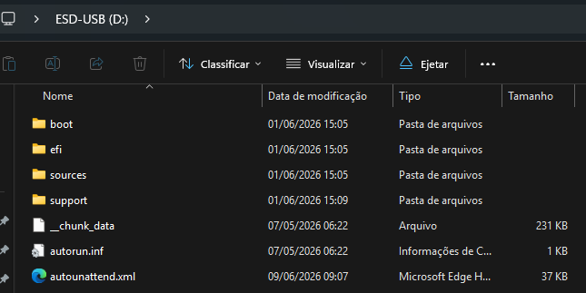

<Callout type="warn" title="Antes de usar">
O script cria umaa conta local com o username[^1] admin e deixa a senha deste usuário vazia. 

Se for reutilizar esse script e queira que haja uma senha padrão para o usuário admin, acesse o [gerador](https://schneegans.de/windows/unattend-generator/)

Importe o arquivo XML:
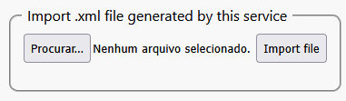

Após importá-lo, procure pelo campo **User accounts** e edite a senha do usuário admin.

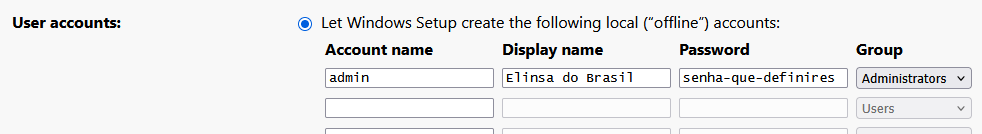

Ao finalizar, procure pelo botão **Download .xml file** e baixe o arquivo atualizado. 

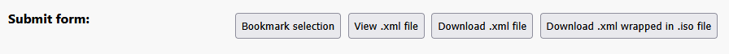
</Callout>

<Callout type="info" title="O que o script faz">

* Aceita os termos de licença do Windows, usa a chave de ativação genérica do Windows 11 Pro (apenas para a instalação, ainda será necessário ativar) e nomeia o computador como `ELIN`.

* Cria a conta local `admin` e define uma senha.

* Previne a instalação de aplicativos que não são usados no dia a dia: Copilot, apps do Xbox, Office Hub, OneNote e Outlook versão Metro (descontinuadas), Solitaire, Skype, Maps, People, Paint 3D, entre outros.

* Pula as telas de conta online, configurações de privacidade e propagandas do Xbox Game Pass e Microsoft 365, mantendo apenas a de configuração de rede.

* Remove recursos preteridos e de IA do Windows: Internet Explorer, WordPad, Windows Media Player, PowerShell ISE, reconhecimento de fala/escrita, Recall etc.

* Ajusta configurações de sistema: habilita caminhos longos, desativa BitLocker automático, desativa rastreamento de último acesso e sugestões/anúncios da Microsoft, desabilitar os Widgets e habilitar a função **Finalizar tarefa** na barra de tarefas.

* Instala o Visual C++ Redistributable (x64) e o Windows Terminal silenciosamente, e ativa o plano de energia "Desempenho".

* Aplica o tema escuro com destaque azul, define um [papel de parede personalizado](https://images.pexels.com/photos/16530781/pexels-photo-16530781.jpeg) (pode não ser aplicado em alguns computadores), adiciona como pastas fixadas no menu Iniciar as Configurações, Downloads e Documentos, e move a barra de tarefas para o lado esquerdo.

* No fim do processo, remove a pasta `Windows.old`, os arquivos de resposta do instalador (incluindo a senha) e qualquer link simbólico deixado no perfil. O sistema fica pronto para uso.
</Callout>

## 3. Instalar aplicativos padrão com o WinGet

Depois que o Windows terminar de instalar, use o WinGet para instalar rapidamente os aplicativos que faltam, como o pacote Office.

<GithubCard href="https://github.com/microsoft/winget-cli" title="WinGet" description="Repositório oficial do Windows Package Manager, o WinGet, mantido pela Microsoft." owner="microsoft" repo="winget-cli" docs="https://learn.microsoft.com/pt-br/windows/package-manager/" />

```shell
# Instala o Microsoft 365 mais recente e na idioma do sistema:

winget install Microsoft.Office
```

<Callout type="info" title="Observação">
Por vezes, o WinGet não consegue instalar o Microsoft 365 por conta do hash do pacote cadastrado no WinGet não bater com o hash do pacote baixado. Nesse caso, em um Terminal com privilégios de administrador, execute o comando: 

```shell
winget settings --enable InstallerHashOverride
```

Depois feche o Terminal e abra-o novamente, desta vez sem privilégios de administrador, e execute o comando:

```shell
winget install -e --id Microsoft.Office --ignore-security-hash
```

Embora o comando acima ignore a verificação de hash, ele ainda verifica a assinatura digital do pacote baixado, garantindo que o pacote seja legítimo.
</Callout>

```shell
# Instala o AnyDesk:

winget install AnyDesk.AnyDesk
```

```shell
# Instala o Google Earth:

winget install Google.EarthPro
```

```shell
# Instala o Telegram:

winget install Telegram.TelegramDesktop
```

Para mais códigos de instalação  com o WinGet, consulte o [repositório winstall](https://winstall.app) ou use o comando 

```shell
winget search "nome do aplicativo" 

# por exemplo: winget search "Google Chrome"
```


[^1]: Neste contexto, o *username* é o que aparece na pasta C:/Users/**admin** e que é usado para login local quando o computador está no domínio Active Directory, isto é, ` .\admin`.