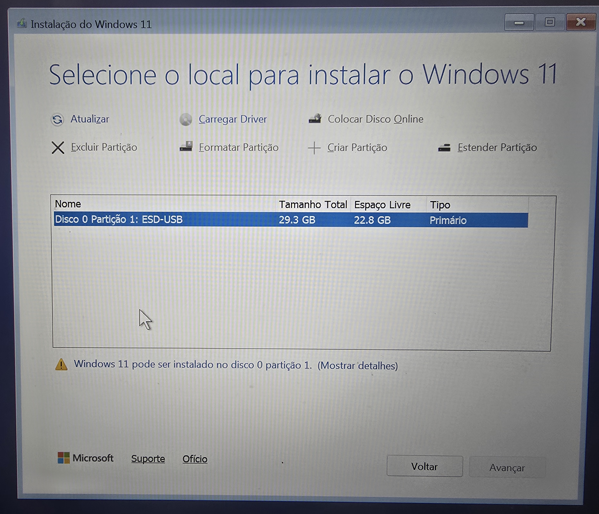
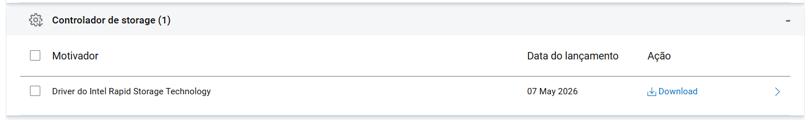
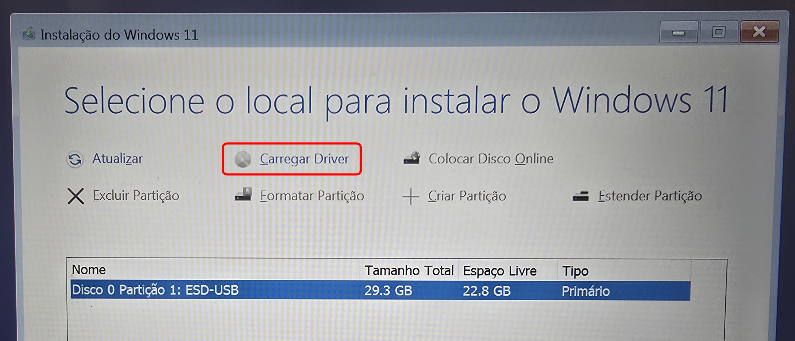
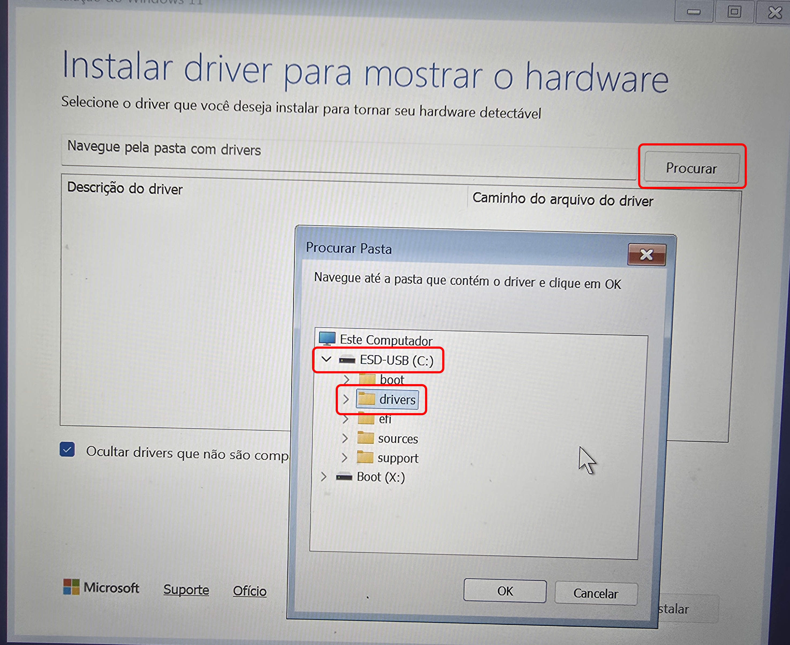
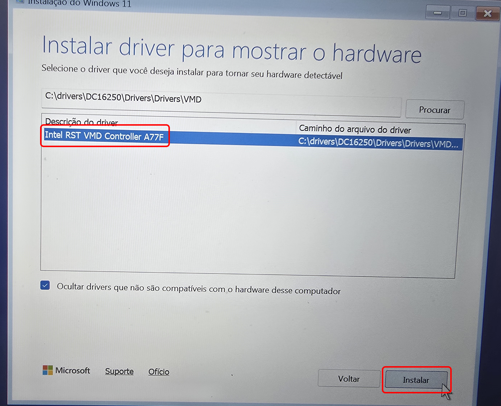
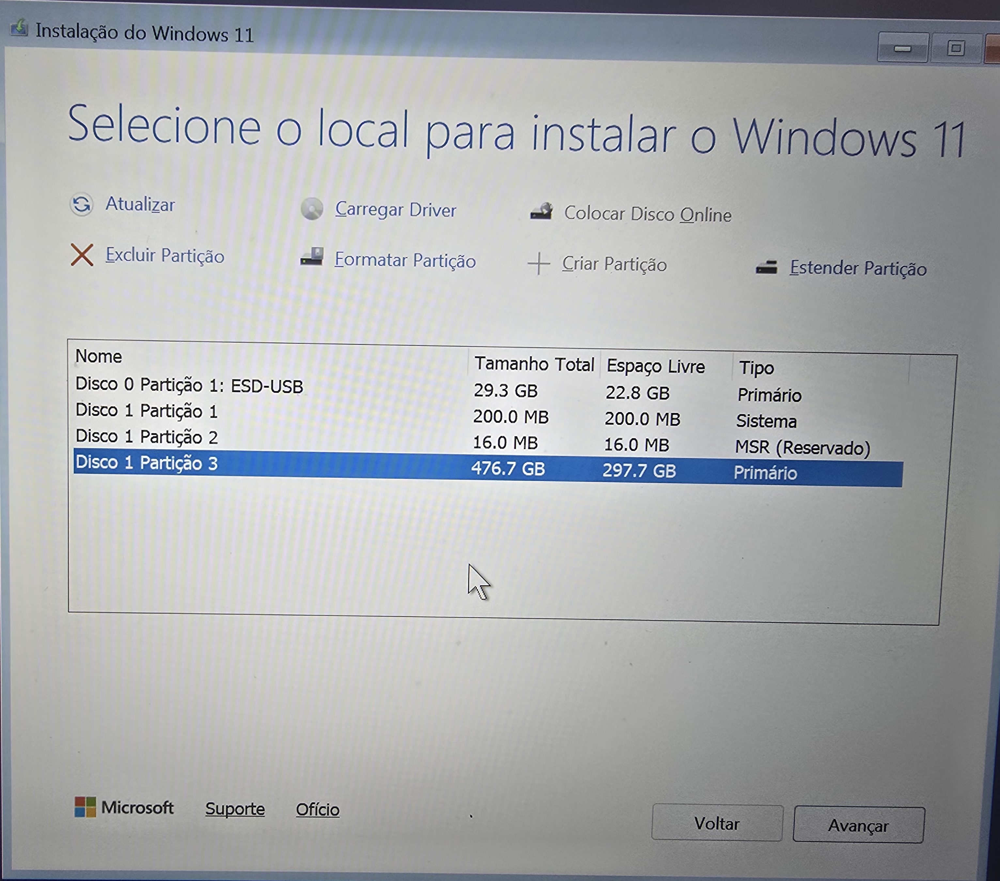

import CapaExtracao from "./images/17-capa-video-extracao.png";

## 1. Criação do PenDrive de instalação

<Callout type="info" title="Pré-requisitos">

* Um PenDrive com pelo menos 8 GB.
* Conexão com a internet para baixar o Windows 11.

</Callout>

1. Acesse o [site da Microsoft](https://www.microsoft.com/pt-br/software-download/windows11) e, na seção **Criar mídia de instalação do Windows 11**, clique em **Baixar Agora**.


<Callout type="info" title="Por que usar a ferramenta de criação de mídia?">
Também é possível baixar a ISO e gravá-la no PenDrive com ferramentas de terceiros, como o Rufus e o Ventoy, mas nesse caso é preciso desligar o Secure Boot para formatar o computador. A mídia criada pela ferramenta da Microsoft funciona com o Secure Boot ligado.
</Callout>

2. Execute o arquivo baixado, **MediaCreationTool.exe**.


3. **Aceite** os termos de licença.


4. Na tela **Selecionar Idioma e edição**, desmarque **Usar as opções recomendadas para este computador**, confira se o idioma está como **português (Brasil)** e a edição como **Windows 11**, e clique em **Avançar**. Essa edição já inclui as versões Home e Pro; a escolha entre elas acontece durante a instalação.


5. Escolha **Unidade flash USB** como mídia e clique em **Avançar**.


6. Selecione o seu PenDrive na lista de unidades removíveis e clique em **Avançar**.


<Callout type="warn" title="Atenção">

Confira se selecionou o PenDrive correto: todo o conteúdo dele será apagado neste processo. Faça backup de qualquer arquivo importante antes de continuar.

</Callout>

7. Aguarde o download do Windows 11 e a criação da mídia de instalação. O tempo varia de acordo com a velocidade da sua internet.


8. Ao final, o PenDrive aparecerá no Explorador de Arquivos como **ESD-USB** e estará pronto para uso.


***

### Opcional: script de instalação semiautomática

Para acelerar a instalação, é possível usar um arquivo de respostas [autounattend.xml](https://learn.microsoft.com/en-us/windows-hardware/manufacture/desktop/update-windows-settings-and-scripts-create-your-own-answer-file-sxs?view=windows-11). Ele responde sozinho às perguntas do instalador do Windows, como aceitar a licença e criar a conta, e torna o processo quase todo automático.

Baixe o arquivo abaixo e copie-o para a raiz do PenDrive criado acima. O instalador detecta o arquivo e aplica as configurações.

<Download href="https://file.elinsadobrasil.com.br/scripts/autounattend.xml" title="autounattend.xml" description="Script de instalação semiautomática do Windows." fileName="autounattend.xml" type="XML" hardFileSize={37 * 1024 * 1} />


<Callout type="info" title="O que o script faz">

* Aceita os termos de licença do Windows, usa a chave genérica do Windows 11 Pro (válida só para a instalação; o Windows ainda precisará ser ativado) e nomeia o computador como `ELIN`.

* Cria a conta local `admin`, sem senha.

* Impede a instalação de aplicativos que não são usados no dia a dia: Copilot, apps do Xbox, Office Hub, as versões Metro (descontinuadas) do OneNote e do Outlook, Solitaire, Skype, Maps, People, Paint 3D, entre outros.

* Pula as telas de conta online, de configurações de privacidade e as propagandas do Xbox Game Pass e do Microsoft 365, mantendo apenas a de configuração de rede.

* Remove recursos obsoletos e de IA do Windows: Internet Explorer, WordPad, Windows Media Player, PowerShell ISE, reconhecimento de fala e escrita, Recall etc.

* Ajusta configurações do sistema: habilita caminhos longos; desativa o BitLocker automático, o rastreamento de último acesso, as sugestões e anúncios da Microsoft e os Widgets; e habilita a função **Finalizar tarefa** na barra de tarefas.

* Instala silenciosamente o Visual C++ Redistributable (x64) e o Windows Terminal, e ativa o plano de energia **Desempenho**.

* Aplica o tema escuro com destaque azul, define um [papel de parede personalizado](https://images.pexels.com/photos/16530781/pexels-photo-16530781.jpeg) (pode não ser aplicado em alguns computadores), fixa as pastas Configurações, Downloads e Documentos no menu Iniciar e move a barra de tarefas para o lado esquerdo.

* No fim do processo, remove a pasta `Windows.old`, os arquivos de resposta do instalador e qualquer link simbólico deixado no perfil. O sistema fica pronto para uso.

</Callout>

<Callout type="warn" title="Antes de usar">
O script cria a conta local com o *username*[^1] `admin` e deixa a senha em branco. Se quiser definir uma senha padrão, edite o arquivo no [gerador de autounattend.xml](https://schneegans.de/windows/unattend-generator/):

1. Importe o arquivo XML.


2. No campo **User accounts**, edite a senha do usuário `admin`.


3. Clique em **Download .xml file** para baixar o arquivo atualizado.


</Callout>

## 2. Instalação do Windows

Conecte o PenDrive ao computador, inicie-o pelo PenDrive e siga as telas do instalador. Se o `autounattend.xml` estiver no PenDrive, a maior parte delas será respondida automaticamente.

### Problema conhecido: o instalador não reconhece o SSD

Em alguns computadores, principalmente com processadores Intel a partir da 11ª geração, a tela **Selecione o local para instalar o Windows 11** lista apenas o PenDrive, mesmo com o SSD aparecendo normalmente na BIOS.



A causa é o **Intel VMD** (*Volume Management Device*), um controlador de armazenamento embutido no processador, usado para RAID e para o Intel Rapid Storage Technology (RST). Com o VMD ativado na BIOS, o SSD NVMe passa a ser acessado por meio dele, mas a imagem de instalação do Windows **não traz o driver do VMD**. Sem o driver, o instalador não enxerga o disco.

Há duas formas de resolver.

#### Opção A: carregar o driver do VMD durante a instalação

É a opção mais segura, pois não altera a BIOS.

1. No site de suporte do fabricante, busque pelo modelo exato do computador e baixe o driver **Intel Rapid Storage Technology**. Evite a versão genérica do site da Intel, que pode não ser compatível com o hardware.

<Callout type="info" title="Fabricantes que usamos na Elinsa">
* [Acer](https://www.acer.com/br-pt/support/drivers-and-manuals)
* [Dell](https://www.dell.com/support/home/pt-br)
* [Vaio](https://www.br.vaio.com/drivers)

O driver costuma ficar na seção **Chipset** ou **Storage**, como neste exemplo da Dell:


</Callout>

2. Execute o arquivo baixado e escolha **extrair** os arquivos, sem instalar. Copie a pasta extraída para a raiz do PenDrive. O vídeo abaixo mostra o processo com o pacote da Dell; em outros fabricantes, as telas podem mudar.

<VideoEmbed
  src="https://file.elinsadobrasil.com.br/videos/docs/extracao-do-driver-intel-rst.mp4" 
  title="Extração do driver Intel Rapid Storage Technology"
  description="No pacote da Dell, marque Extract files to this PC to install later, clique em Continue e escolha a pasta de destino. Ao final, a pasta VMD aparece entre os arquivos extraídos."
  poster={CapaExtracao}
/>

3. De volta ao instalador, na tela de seleção do disco, clique em **Carregar Driver** e depois em **Procurar**.



4. Selecione a pasta extraída e clique em **OK**. Na lista que aparece, escolha o **Intel RST VMD Controller** e clique em **Instalar**.





<Callout type="info">
O código no fim do nome do driver varia de acordo com o modelo do computador.
</Callout>

5. O SSD passará a aparecer na lista.



#### Opção B: desativar o VMD na BIOS

Essa alternativa dispensa o driver. O caminho e o nome da opção variam conforme o fabricante e o modelo, então consulte a documentação de suporte do computador.

Para o usuário final não há diferença perceptível: o Windows funciona da mesma forma com o VMD ativado ou desativado.

<Callout type="warn" title="Decida antes de instalar">
Não altere essa configuração depois que o Windows estiver instalado: o sistema deixará de iniciar e mostrará uma tela azul ou preta com o erro **INACCESSIBLE_BOOT_DEVICE**.
</Callout>

***

Com o SSD listado, selecione-o e prossiga com a instalação, respondendo às telas que o instalador apresentar.

## 3. Instalar aplicativos padrão com o WinGet

Com o Windows instalado, use o WinGet para instalar rapidamente os aplicativos que faltam, como o pacote Office. Os comandos abaixo são executados no **Terminal**.

<GithubCard href="https://github.com/microsoft/winget-cli" title="WinGet" description="Repositório oficial do Windows Package Manager, o WinGet, mantido pela Microsoft." owner="microsoft" repo="winget-cli" docs="https://learn.microsoft.com/pt-br/windows/package-manager/" />

```shell
# Instala a versão mais recente do Microsoft 365, no idioma do sistema:

winget install Microsoft.Office
```

<Callout type="info" title="Observação">
Às vezes o WinGet não consegue instalar o Microsoft 365 porque o hash cadastrado no WinGet não bate com o do pacote baixado. Nesse caso, abra o Terminal como administrador e execute:

```shell
winget settings --enable InstallerHashOverride
```

Depois, feche o Terminal, abra-o novamente sem privilégios de administrador e execute:

```shell
winget install -e --id Microsoft.Office --ignore-security-hash
```

Esse comando ignora apenas a conferência do hash: a assinatura digital do pacote continua sendo verificada, o que garante que ele é legítimo.
</Callout>

```shell
# Instala o AnyDesk:

winget install AnyDesk.AnyDesk
```

```shell
# Instala o Google Earth:

winget install Google.EarthPro
```

```shell
# Instala o Telegram:

winget install Telegram.TelegramDesktop
```

Para encontrar o identificador de outros aplicativos, consulte o site [winstall](https://winstall.app) ou use o comando:

```shell
winget search "nome do aplicativo"

# Por exemplo: winget search "Google Chrome"
```

[^1]: Neste contexto, *username* é o nome que aparece na pasta `C:\Users\admin` e que é usado para fazer login na conta local quando o computador está em um domínio do Active Directory, isto é, `.\admin`.
