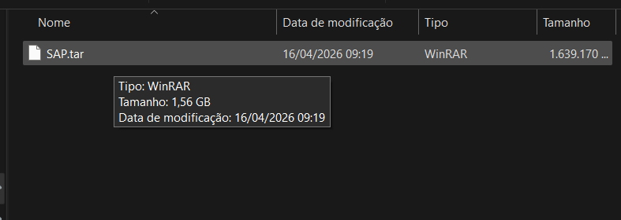
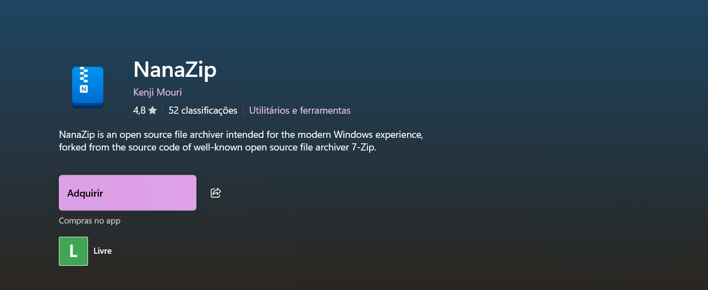
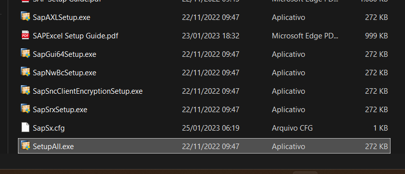
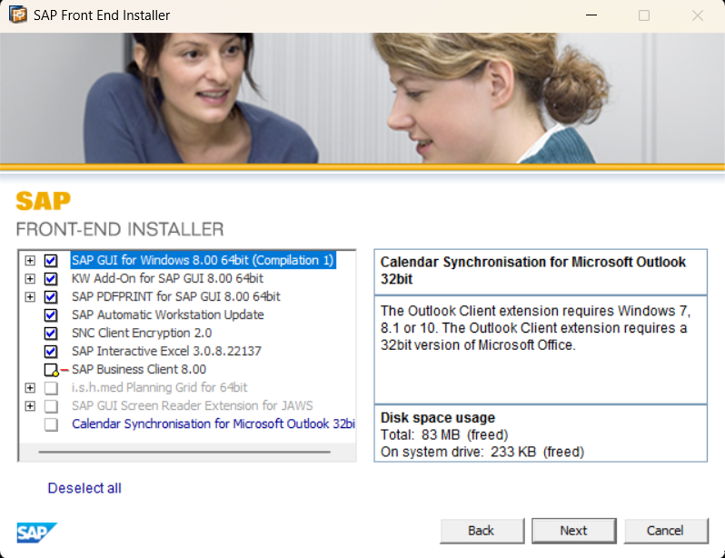
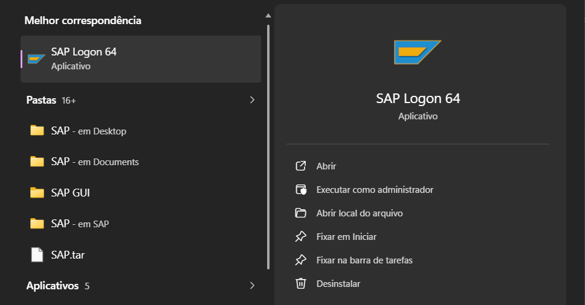
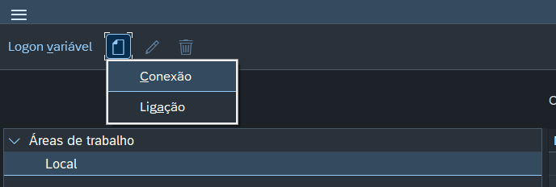
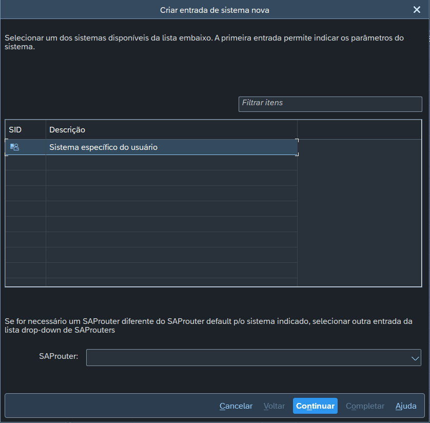
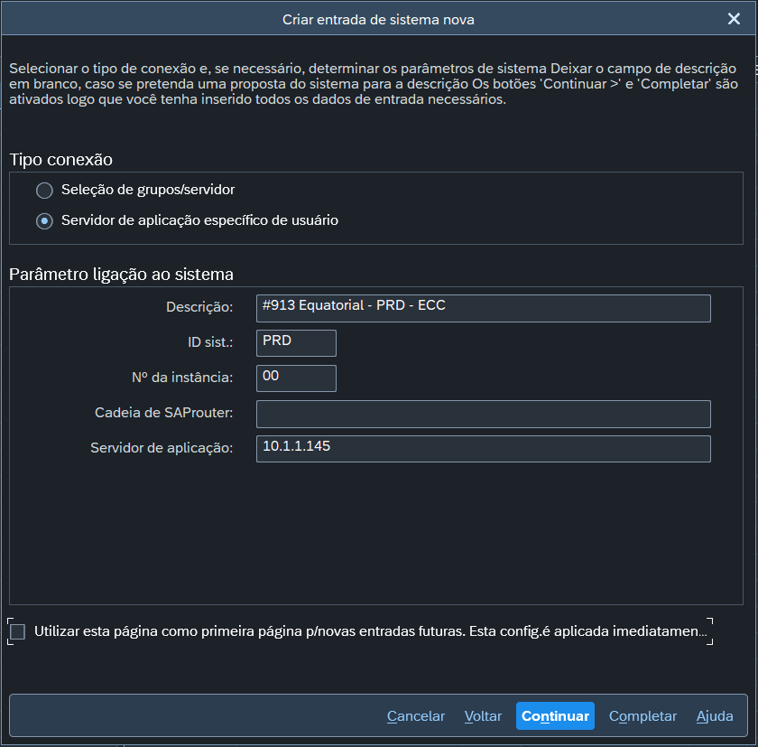
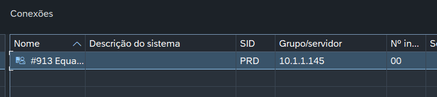
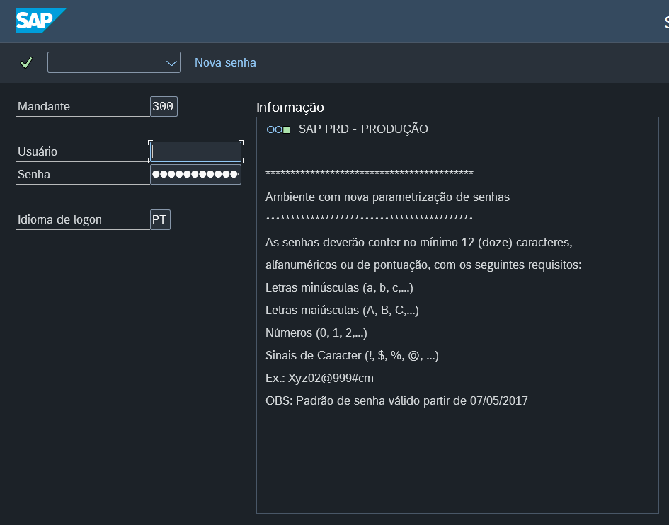

A instalação do SAP em uma máquina local tem três etapas: criar um usuário local no Windows, instalar o SAP GUI e configurar a conexão com o servidor.

---

## 1. Criação do usuário local

Esse usuário é o que você vai usar para abrir o SAP no fim do tutorial.

1. Abra o **Prompt de Comando**. É obrigatório executar como **administrador**.
2. Digite o comando abaixo e pressione `Enter`:

```cmd
net user NomeDoUsuario Senha /add
```

<Callout type="warning" title="Atenção">

* Substitua `NomeDoUsuario` pela **credencial da Equatorial** do colaborador.
* Substitua `Senha` por uma senha de sua preferência. Ela vale apenas para este acesso local, então pode ser simples.

</Callout>

---

<DownloadableFile href="https://file.elinsadobrasil.com.br/compressed/sap.7z" fileName="sap.tar" description="Arquivo de instalação do SAP Logon 64" type="7z" title="SAP"/>

---

## 2. Extração e instalação do SAP

1. Localize o arquivo compactado **sap.tar**.
2. Extraia o conteúdo dele.

<div className="flex justify-center my-5">



</div>

<Callout type="info" title="Dica para usuários do Windows 10">

Se o Windows não extrair arquivos `.tar` nativamente, instale o **NanoZip**, que é gratuito na [Microsoft Store](https://apps.microsoft.com/detail/9n8g7tscl18r?hl=pt-BR&gl=BR).


</Callout>


3. Depois de extrair, navegue até a pasta `Win64`, seguindo este caminho:
   `SAP_GUI_for_Windows_8.00_Comp._1_` > `PRES1` > `GUI` > `Windows` > `Win64`

4. Dentro da pasta `Win64`, localize o executável `SetupAll.exe`.
5. Clique com o botão direito sobre ele e selecione **Executar como administrador**.

<div className="flex justify-center my-5">



</div>

6. O assistente de instalação abre. Na tela de seleção de componentes, marque todas as caixas, **exceto a última**.

<div className="max-w-[450px] mx-auto my-5">



</div>

7. Clique em **Next** (Avançar) nas telas seguintes até a instalação terminar.
8. Terminada a instalação, procure por **SAP Logon 64** no menu Iniciar e abra o programa.

<div className="flex justify-center my-5">



</div>

---

## 3. Configuração do SAP local

Falta apontar o SAP Logon para o servidor da empresa.

1. Saia do seu usuário atual do Windows.
2. Faça login na máquina com o **novo usuário** que você criou no passo 1.
3. Já no novo usuário, abra o **SAP Logon 64**.
4. No canto superior esquerdo da janela, clique no ícone de **Arquivo** e selecione **Conexão**.

<div className="flex justify-center my-5">



</div>

5. Na janela de criação de sistema que abrir, clique em **Continuar**.

<div className="max-w-[450px] mx-auto my-5">



</div>

6. Preencha os campos exatamente com estas informações:

   * **Descrição:** `#913 Equatorial - PRD - ECC`
   * **ID Sist.:** `PRD`
   * **Número da Instância:** `00`
   * **Cadeia de SAProuter:** *(deixe o campo vazio)*
   * **Servidor de Aplicação:** `10.1.1.145`

<div className="max-w-[450px] mx-auto my-5">



</div>

7. Clique em **Continuar** nas telas seguintes até a janela de configuração fechar.
8. Na tela inicial do SAP Logon, dê **dois cliques** na conexão que você acabou de criar, na primeira linha da lista.

<div className="flex justify-center my-5">



</div>

9. A tela de login do SAP deve aparecer.

<div className="max-w-[450px] mx-auto my-5">



</div>

Se a tela de login apareceu, a configuração está concluída e o SAP já pode ser usado na máquina.
